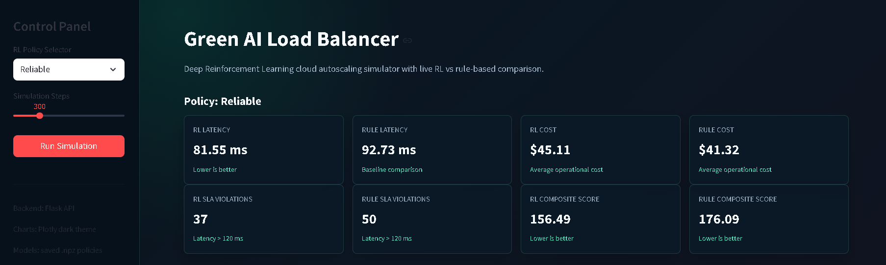
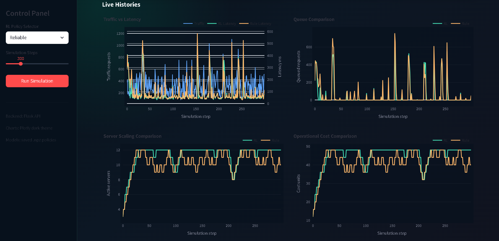
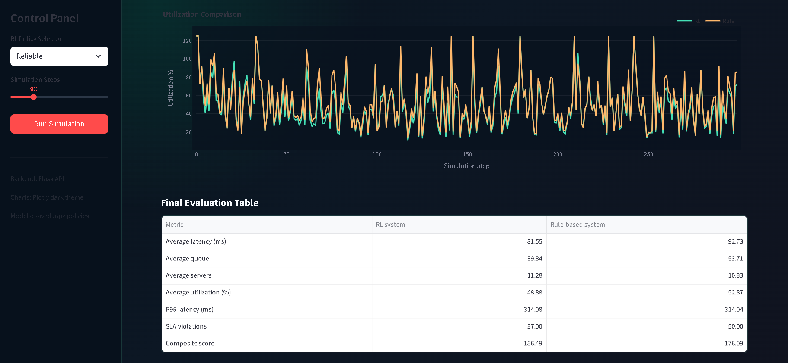
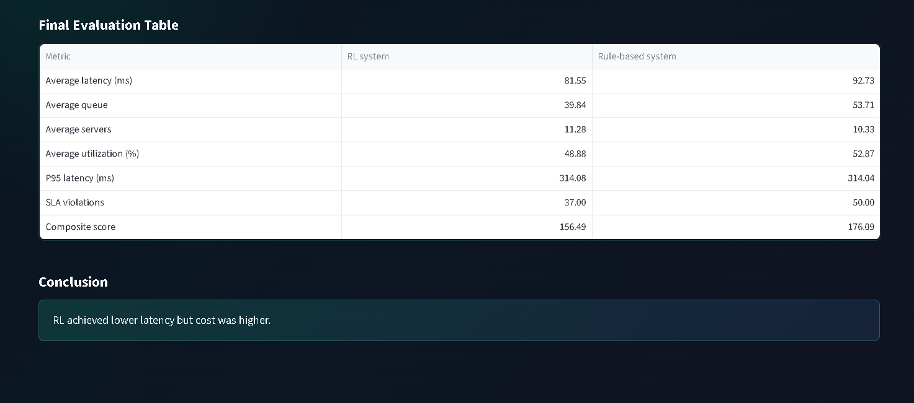

# 🌱 Green AI Load Balancer using Deep Reinforcement Learning




<div align="center">

## ⚡ Intelligent Cloud Resource Optimization with AI ⚡

An AI-powered cloud load balancing system that uses **Deep Q-Learning Reinforcement Learning** to automatically scale cloud servers, reduce energy consumption, minimize cost, and maintain high performance.

</div>

---

# 📌 Project Overview

Modern cloud applications receive constantly changing user traffic. Traditional rule-based load balancers use fixed conditions and cannot adapt intelligently to changing workloads.

This project introduces an **AI-driven Green Load Balancer** that learns from cloud traffic patterns and automatically decides the best server scaling action.

The system uses a **Deep Q-Learning Agent** that observes the cloud environment, performs actions, receives rewards, and improves its decision-making ability over time.

The goal is to achieve:

* ⚡ Lower latency
* 🌱 Reduced energy usage
* 💰 Optimized server cost
* 📈 Better resource utilization
* 🤖 Intelligent auto-scaling

---

# 🎯 Problem Statement

Traditional cloud auto-scaling methods depend on fixed threshold rules.

Example:

```
If CPU > 70%
      Add Server

If CPU < 30%
      Remove Server
```

These methods cannot:

❌ Learn from previous decisions
❌ Predict workload changes
❌ Balance cost and performance dynamically

This project solves the problem using **Reinforcement Learning**, where the system learns optimal scaling strategies through experience.

---

# 🧠 AI Concept Used

## Deep Reinforcement Learning (DQN)

The project uses a **Deep Q-Learning Agent**.

The agent learns:

```
Cloud State
      |
      v
AI Agent
      |
      v
Best Scaling Action
```

The agent observes:

* Incoming traffic requests
* Active servers
* Queue size
* Server utilization
* Time pattern
* Traffic trend

The AI predicts one of five actions:

| Action | Meaning              |
| ------ | -------------------- |
| 0      | Keep current servers |
| 1      | Add 1 server         |
| 2      | Remove 1 server      |
| 3      | Add 2 servers        |
| 4      | Remove 2 servers     |

---

# 🏗️ System Architecture

```

                Dataset
                   |
                   v

             main.py

                   |
                   v

       Traffic Simulation Engine

                   |
                   v

            QLearning Agent
            (q_learning.py)

                   |
                   v

        Predict Scaling Action

                   |
                   v

      Reward / Penalty Calculation

                   |
                   v

          Update Neural Weights

                   |
                   v

          Save Trained Models


================================================


              Dashboard

                   |
                   v

              Flask API

                   |
                   v

          Load Saved AI Model

                   |
                   v

          Run Evaluation

                   |
                   v

        Display Performance Graphs

```

---

# 📂 Project Structure

```
Green-AI-Load-Balancer

│
├── main.py
│
├── api.py
│
├── dashboard.py
│
├── requirements.txt
│

├── r1_agent/
│       |
│       └── q_learning.py
│

├── baseline/
│       |
│       └── rule_based.py
│

├── data/
│       |
│       └── cleaned_dataset.csv
│

├── results/
        |
        ├── cheap_model.npz
        ├── balanced_model.npz
        └── rich_model.npz

```

---

# 🔥 Working of the Project

## 1️⃣ Training Phase (`main.py`)

`main.py` creates the cloud simulation environment.

Responsibilities:

✔ Generate realistic cloud traffic
✔ Send cloud state to AI
✔ Receive scaling decisions
✔ Calculate reward
✔ Train the model
✔ Save learned weights

Traffic generation includes:

```
Total Traffic =
Base Traffic
+
Daily Pattern
+
Lunch Peak
+
Evening Peak
+
Random Spikes
```

This creates realistic workloads similar to actual cloud applications.

---

## 2️⃣ AI Agent (`q_learning.py`)

This file contains the intelligence of the system.

Main component:

```python
class QLearningAgent
```

Important functions:

### get_state()

Converts cloud information into AI input.

Example:

```
Traffic
Servers
Queue
Utilization

        ↓

AI State
```

### choose_action()

Predicts Q-values and selects the best server action.

### remember()

Stores previous experience:

```
State
Action
Reward
Next State
```

### replay()

Trains the neural network by updating weights.

---

# 💾 Model Saving

After training:

```python
agent.save()
```

stores learned weights as:

```
cheap_model.npz

balanced_model.npz

rich_model.npz
```

Each model has a different goal:

## 💰 Cheap Model

Focus:

* Lower server usage
* Reduced energy cost

## ⚖️ Balanced Model

Focus:

* Cost + performance balance

## 🚀 Reliable Model

Focus:

* Minimum latency
* Maximum availability

---

# 📊 Dashboard & Evaluation

After training, models are tested through the dashboard.

User selects:

```
Policy:
Cheap / Balanced / Reliable

Simulation Steps:
Example: 300
```

The system:

1. Loads selected model
2. Generates test traffic
3. AI predicts scaling actions
4. Calculates performance metrics
5. Displays graphs

Metrics:

📌 Latency
📌 Server Usage
📌 Queue Length
📌 Cost
📌 Utilization
📌 SLA Violations

---

# 📸 Output Screenshots

## 🖥️ Dashboard Overview


---

## 📈 Traffic & Server Scaling



---

## ⚡ Performance Metrics



---

## 📊 Comparison Results



---

# 🛠️ Technologies Used

| Technology      | Purpose                 |
| --------------- | ----------------------- |
| Python          | Core Programming        |
| Flask           | Backend API             |
| Streamlit       | Dashboard UI            |
| NumPy           | Mathematical Processing |
| Pandas          | Dataset Handling        |
| Plotly          | Visualization           |
| Deep Q-Learning | AI Decision Making      |

---

# ▶️ How to Run Project

Clone repository

```bash
git clone <repository-url>
```

Install dependencies

```bash
pip install -r requirements.txt
```

Start API server

```bash
python api.py
```

Run dashboard

```bash
streamlit run dashboard.py
```

---

# 🔮 Future Improvements

* ☁️ Deploy with real cloud platforms like AWS/Azure
* 📡 Use live traffic monitoring
* 🧠 Implement advanced Deep RL algorithms
* 🔋 Add energy consumption prediction
* 📈 Improve workload forecasting
* 🐳 Add Docker container deployment

---

# 🌟 Conclusion

This project demonstrates how Artificial Intelligence can improve cloud resource management.

By using Deep Reinforcement Learning, the system learns optimal scaling decisions instead of depending on fixed rules.

The result is a smarter, adaptive, and greener cloud load balancing solution.

---

⭐ If you like this project, give it a star on GitHub!
